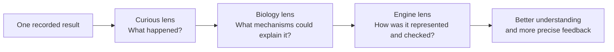
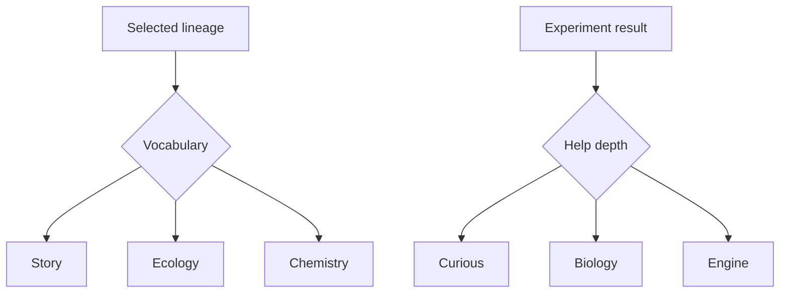
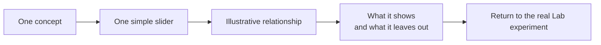
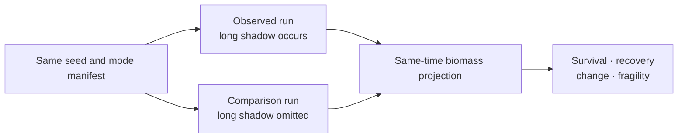

# Education and help

## Purpose and claim level

Evolution Lab is a learning and exploration tool, not an academic claim or a scientific proof. It should be plausibly close to relevant scientific thinking at the population-aggregate level, explicit about its assumptions, and easy to challenge. A useful specialist review asks whether the represented mechanisms, trade-offs, omissions and causal explanations are defensible at that level—not whether an uncalibrated prototype predicts exact natural rates.

The interface must help a curious person build enough understanding to question the model precisely. It uses ordinary language first, then adds biological and implementation depth without changing the underlying facts.

## One result, three cumulative lenses

- **Curious** assumes no biology or computer-science knowledge. It keeps useful terms but explains them immediately.
- **Biology** adds the represented ecological mechanisms, assumptions and scientific caveats.
- **Engine** adds data, thresholds, deterministic comparison and implementation limits. Terms such as “fitness vector” are appropriate here when defined.
- The lenses are cumulative views over shared fact and limitation identifiers. They must not become three competing stories.

A short claim-level note belongs near the top of specialist views so a reviewer knows what kind of challenge is useful.

## Two local controls with different jobs

Story/Ecology/Chemistry changes how the selected lineage is described. It therefore lives inside the lineage-description area. Curious/Biology/Engine changes the depth of explanation for an experiment result. It lives inside the help panel. Keeping each control beside the words it affects avoids an apparent fourth, conflicting language system.

## Diagrams, captures and concept demos

Documentation should teach visually where a relationship is easier to see than to read. Use:

- small diagrams for cause, data flow and boundaries;
- labelled captures from the real UI when explaining a real control or result;
- paired “with/without” views for comparisons;
- tiny concept demos for one relationship at a time.

A UI capture must show, or be accompanied by, the relevant Lab/mode/scenario version identity. A capture is an explanation of that release, not timeless scientific evidence.

A concept demo is presentation-only:

Concept demos do not call the engine, change a seed, modify experiment state or claim to predict the main simulation. They may use deliberately simple direct or inverse mappings as long as the UI labels them as illustrations.

## Current Exobiology example

The first evaluation view compares two complete deterministic runs with the same seed and authored configuration. The comparison run moves the long shadow beyond the experiment; nothing else is intentionally changed.

The current view can honestly show aggregate active biomass and which predefined lineages remain. It checks finite state, non-negative stocks and exact repeatability. It cannot yet prove full matter conservation, identify growth/accounting debt, restore a discarded checkpoint, or establish scientific calibration. “Recovery” currently means returning to a declared fraction of the continuing same-time comparison for a declared duration; it does not mean that every lineage or ecological relationship returned to its former state.

## Ownership

- Framework-neutral help content and concept-demo projections: `src/lib/help`.
- Framework-neutral paired-run evaluation: `src/lib/analysis`.
- Scene-setting projection: `src/lib/projections/scene.ts`.
- Help and feedback rendering: `src/lib/components/HelpPanel.svelte` and `ExperimentFeedback.svelte`.
- Lineage vocabulary control: `src/lib/components/LineageInspector.svelte`.
- Canonical code and test routing: `docs/ENGINE_MAP.md`.

Do not duplicate these facts as independent component-local prose. New diagrams or help views should project the same named facts, assumptions and limitations.
